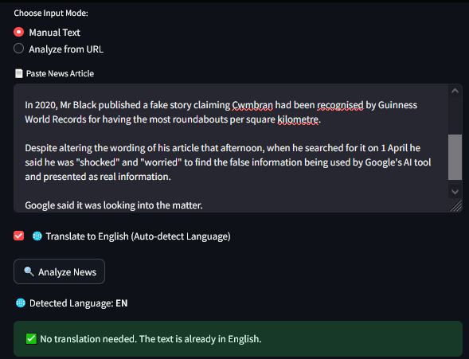
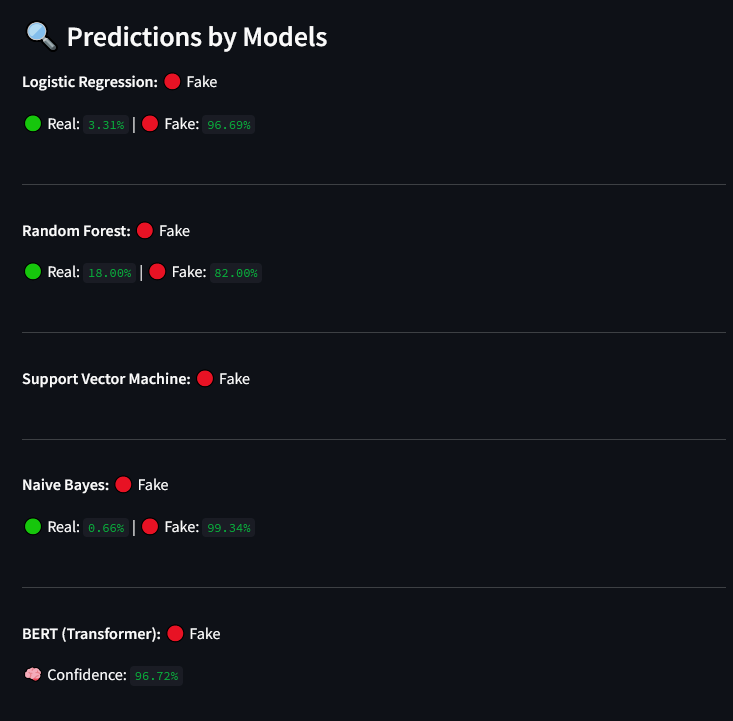
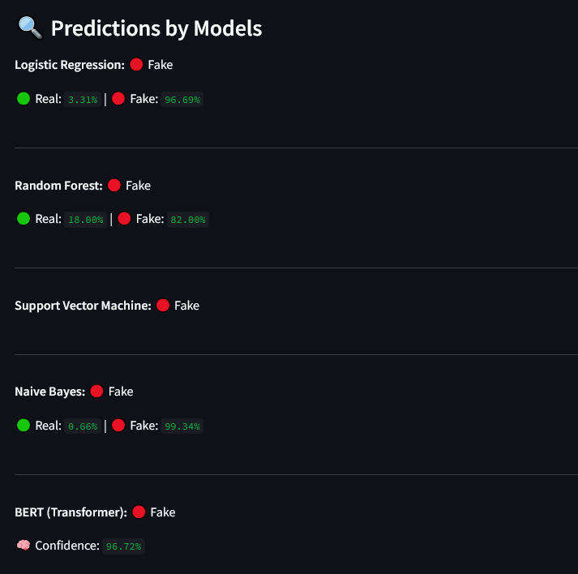

# 📰 Fake News Detector (BERT + Streamlit)

A real-time fake news detection web application built using a fine-tuned BERT model with an elegant Streamlit interface. The system supports manual input and URL-based article analysis with multilingual support and clean visual feedback.


The Fake News Detection Web Application is a locally deployed tool that uses traditional machine learning algorithms like Logistic Regression and Random Forest to classify news articles as real or fake. It offers a simple web interface for real-time predictions, aiming to combat misinformation and promote media awareness.

---
## 🧠 Model Architecture: BERT-Powered Fake News Detection System

---
## 🧪 Screenshots

--

--

--

--

## 🔍 Features

- 🧠 BERT-based classification of news articles as **Fake** or **Real**
- 🌐 URL scraping using `newspaper3k` and auto language detection
- ✨ Real-time feedback with model-wise comparison: Logistic Regression, Random Forest, SVM, Naive Bayes, and BERT
- 📊 Dynamic confidence bars (green = Real, red = Fake)
- 🌍 Auto-translation for non-English news using Google Translate
- 📱 Streamlit-powered UI with dark mode and modern UX

---

## 🛠️ Tech Stack

- **Frontend**: Streamlit
- **ML Models**: 
  - Logistic Regression
  - Random Forest
  - Naive Bayes
  - SVM
  - BERT (`transformers` by HuggingFace)
- **Vectorizers**: `TfidfVectorizer`, `CountVectorizer`
- **Tools**: `joblib`, `torch`, `langdetect`, `deep-translator`, `newspaper3k`

---

## 🚀 How to Run

### 1. Clone the Repository

```bash
git clone https://github.com/PankajMahanto/FakeNewsDetection.git
cd FakeNewsDetection
```
### 2. Create a Virtual Environment (Optional but Recommended)

```bash
python -m venv venv
source venv/bin/activate  # On Windows: venv\Scripts\activate

```

### 3. Install Requirements
```
bash
pip install -r requirements.txt
```
### 4. Run the App
```
bash
streamlit run app.py
```

## 📁 Project Structure
```
bash

|—— .gitattributes
|—— app.ipynb
|—— app.py
|—— app_rf.ipynb
|—— bert_fakenews
|    |—— config.json
|    |—— model.safetensors
|    |—— special_tokens_map.json
|    |—— tokenizer.json
|    |—— tokenizer_config.json
|    |—— vocab.txt
|—— bert_fakenews_vs.ipynb
|—— copy-app.py
|—— Datasets
|    |—— Fake.csv
|    |—— True.csv
|—— Datasets.zip
|—— lr_model.jb
|—— model.jb
|—— model_load.ipynb
|—— nb_model.jb
|—— r.md
|—— requirements.txt
|—— rf_model.jb
|—— rf_model.zip
|—— svm_model.jb
|—— tfidf_vectorizer.jb
|—— train_bert.py
|—— train_bert_news.ipynb
|—— Train_nb.ipynb
|—— train_svm.ipynb
|—— vectorizer.jb
|—— vectorizer_nb.jb
|—— vectorizer_rf.jb
|—— visualization_of_project.ipynb
```
## Code Details
### Tested Platform
- software
  ```
  OS: Debian unstable (May 2021), Ubuntu LTS
  Python: 3.8.5 (anaconda)
  PyTorch: 1.7.1, 1.8.1
  ```
- hardware
  ```
  CPU: Intel Xeon 6226R / Normal CPU work
  GPU: No Needed (24GB)
  RAM: At least 8GB
  ```

## 👤 Author
Made with ❤️ by  [Pankaj Mahanta](https://github.com/PankajMahanto/)